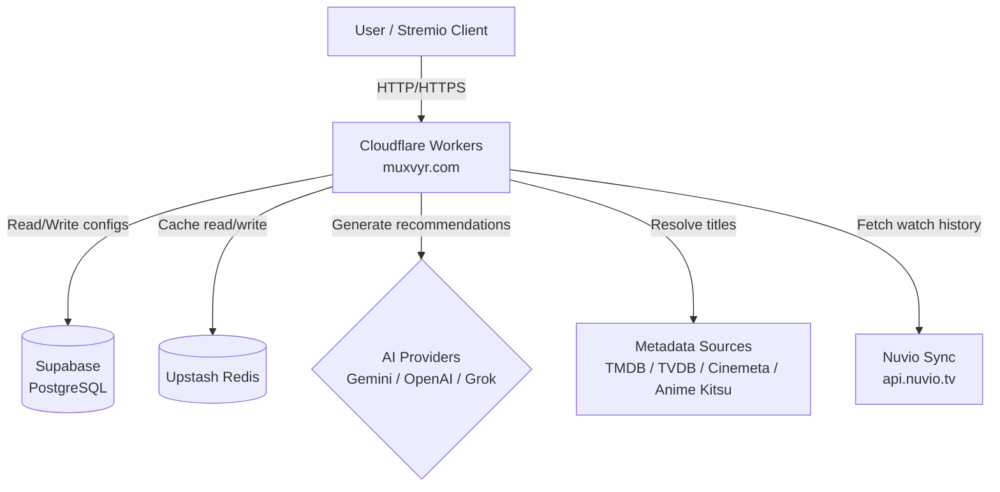
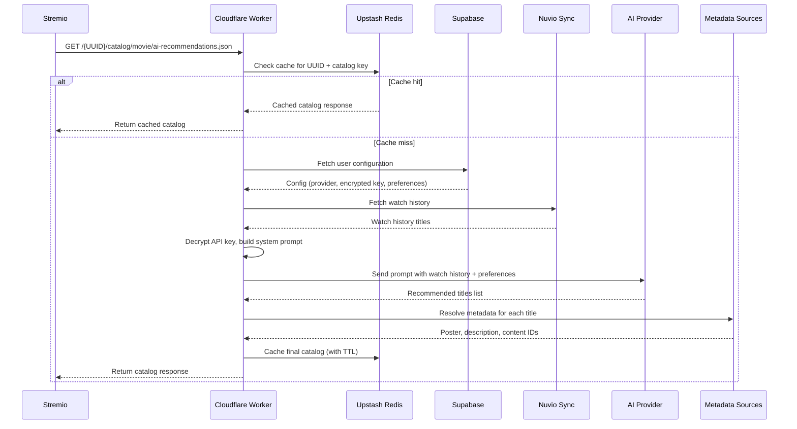
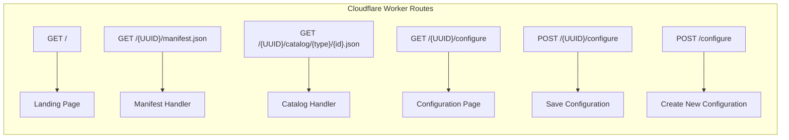
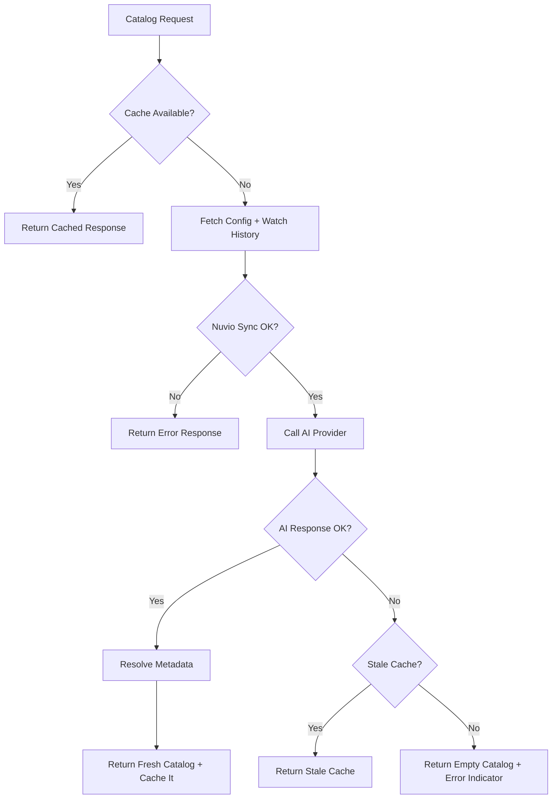

# Design Document: Stremio AI Recommendations Add-on

## Overview

This document describes the technical design for a Stremio add-on that delivers AI-powered content recommendations. The system is a serverless application running on Cloudflare Workers, using Supabase (PostgreSQL) for persistent storage, Upstash Redis for caching, and external AI providers (Gemini, OpenAI, Grok) for generating personalized recommendations based on a user's Nuvio Sync watch history.

Each user receives a unique UUID-based manifest URL (`muxvyr.com/{UUID}/manifest.json`) that Stremio uses to load personalized catalogs. The configuration page at `muxvyr.com/{UUID}/configure` allows users to manage their settings via a Material Design 3 interface.

### Key Design Decisions

1. **Cloudflare Workers as the sole compute layer** — eliminates server management, provides global edge distribution, and naturally enforces HTTPS via Cloudflare's network.
2. **UUID-based routing without authentication** — simplifies the user experience (no login required) while still isolating configurations. The UUID itself acts as a bearer token.
3. **AES-256-GCM via Web Crypto API** — Cloudflare Workers support the Web Crypto API natively, enabling encryption without external dependencies.
4. **Upstash Redis over Cloudflare KV** — provides TTL-based expiration, atomic operations, and a REST-based interface compatible with Workers (no TCP sockets needed).
5. **Waterfall metadata resolution** — queries metadata sources in priority order (TMDB → TVDB → Cinemeta → Anime Kitsu) and short-circuits on first match to minimize latency.

## Architecture

### System Context Diagram



### High-Level Data Flow



### Worker Routing Structure



## Components and Interfaces

### 1. Router (Entry Point)

The Cloudflare Worker uses a lightweight router to dispatch incoming requests.

```typescript
interface WorkerEnv {
  SUPABASE_URL: string;
  SUPABASE_SERVICE_KEY: string;
  UPSTASH_REDIS_URL: string;
  UPSTASH_REDIS_TOKEN: string;
  ENCRYPTION_KEY: string; // 256-bit key, hex-encoded
}

// Route patterns
type Route = {
  pattern: RegExp;
  method: "GET" | "POST";
  handler: (request: Request, env: WorkerEnv, params: Record<string, string>) => Promise<Response>;
};
```

### 2. Configuration Service

Handles CRUD operations for user configurations.

```typescript
interface UserConfiguration {
  uuid: string;
  ai_provider: "gemini" | "openai" | "grok";
  encrypted_api_key: string;        // AES-256-GCM encrypted, base64-encoded
  api_key_iv: string;               // Initialization vector, base64-encoded
  languages: string[];              // ISO 639-1 codes
  nuvio_credentials: string;        // Encrypted Nuvio auth token
  nuvio_credentials_iv: string;
  fine_tuning_params?: string;      // Optional free-text tuning instructions
  country_filter?: string[];        // ISO 3166-1 alpha-2 codes
  genre_exclusions?: string[];
  genre_preferences?: string[];
  created_at: string;               // ISO 8601 timestamp
  updated_at: string;               // ISO 8601 timestamp
}
```

### 3. Encryption Service

Provides AES-256-GCM encryption/decryption using the Web Crypto API.

```typescript
interface EncryptionService {
  encrypt(plaintext: string, key: CryptoKey): Promise<{ ciphertext: string; iv: string }>;
  decrypt(ciphertext: string, iv: string, key: CryptoKey): Promise<string>;
  importKey(hexKey: string): Promise<CryptoKey>;
}
```

### 4. Nuvio Sync Client

Fetches user watch history from Nuvio Sync.

```typescript
interface NuvioSyncClient {
  getWatchHistory(credentials: string): Promise<WatchHistoryItem[]>;
}

interface WatchHistoryItem {
  title: string;
  type: "movie" | "series";
  imdb_id?: string;
  year?: number;
  watched_at: string;
}
```

### 5. AI Recommendation Engine

Constructs prompts and communicates with AI providers.

```typescript
interface AIRecommendationEngine {
  generateRecommendations(config: RecommendationContext): Promise<RecommendedTitle[]>;
}

interface RecommendationContext {
  provider: "gemini" | "openai" | "grok";
  apiKey: string;                    // Decrypted, in-memory only
  watchHistory: WatchHistoryItem[];
  languages: string[];
  fineTuningParams?: string;
  countryFilter?: string[];
  genreExclusions?: string[];
  genrePreferences?: string[];
  catalogType: "general" | "because-you-watched";
  referenceTitleForByw?: string;     // For "Because you watched..." catalogs
}

interface RecommendedTitle {
  title: string;
  type: "movie" | "series";
  year?: number;
  reason?: string;
}
```

### 6. Metadata Resolver

Resolves AI-generated title names into Stremio-compatible metadata objects.

```typescript
interface MetadataResolver {
  resolve(title: RecommendedTitle): Promise<StremioMetaPreview | null>;
}

interface StremioMetaPreview {
  id: string;           // e.g., "tt1234567" (IMDB ID)
  type: "movie" | "series";
  name: string;
  poster: string;       // URL to poster image
  description?: string;
  releaseInfo?: string;
  imdbRating?: string;
}
```

### 7. Cache Service

Manages Redis caching with structured key patterns.

```typescript
interface CacheService {
  getCatalog(uuid: string, catalogId: string): Promise<StremioMetaPreview[] | null>;
  setCatalog(uuid: string, catalogId: string, data: StremioMetaPreview[], ttlSeconds: number): Promise<void>;
  getMetadata(imdbId: string): Promise<StremioMetaPreview | null>;
  setMetadata(imdbId: string, data: StremioMetaPreview, ttlSeconds: number): Promise<void>;
  invalidateUser(uuid: string): Promise<void>;
}
```

### 8. Manifest Builder

Generates Stremio-compatible manifest JSON per user.

```typescript
interface ManifestBuilder {
  build(uuid: string, watchHistory: WatchHistoryItem[]): StremioManifest;
}

interface StremioManifest {
  id: string;
  version: string;
  name: string;
  description: string;
  resources: Array<string | { name: string; types: string[]; idPrefixes?: string[] }>;
  types: string[];
  catalogs: Array<{
    type: string;
    id: string;
    name: string;
    extra?: Array<{ name: string; isRequired: boolean }>;
  }>;
}
```

## Data Models

### Supabase Database Schema

```sql
-- Enable UUID extension
CREATE EXTENSION IF NOT EXISTS "uuid-ossp";

-- User configurations table
CREATE TABLE user_configurations (
  uuid UUID PRIMARY KEY DEFAULT uuid_generate_v4(),
  ai_provider TEXT NOT NULL CHECK (ai_provider IN ('gemini', 'openai', 'grok')),
  encrypted_api_key TEXT NOT NULL,
  api_key_iv TEXT NOT NULL,
  languages TEXT[] NOT NULL DEFAULT '{}',
  nuvio_credentials TEXT NOT NULL,
  nuvio_credentials_iv TEXT NOT NULL,
  fine_tuning_params TEXT,
  country_filter TEXT[],
  genre_exclusions TEXT[],
  genre_preferences TEXT[],
  created_at TIMESTAMPTZ NOT NULL DEFAULT NOW(),
  updated_at TIMESTAMPTZ NOT NULL DEFAULT NOW()
);

-- Index for fast UUID lookups (primary key already indexed)
-- Updated_at trigger
CREATE OR REPLACE FUNCTION update_updated_at()
RETURNS TRIGGER AS $$
BEGIN
  NEW.updated_at = NOW();
  RETURN NEW;
END;
$$ LANGUAGE plpgsql;

CREATE TRIGGER set_updated_at
  BEFORE UPDATE ON user_configurations
  FOR EACH ROW
  EXECUTE FUNCTION update_updated_at();

-- Row Level Security
ALTER TABLE user_configurations ENABLE ROW LEVEL SECURITY;

-- Policy: Service role can do everything (used by Worker)
CREATE POLICY "service_role_all" ON user_configurations
  FOR ALL
  USING (true)
  WITH CHECK (true);

-- Policy: Anon/authenticated users cannot access directly
-- (All access goes through the Worker using service role key)
CREATE POLICY "deny_public" ON user_configurations
  FOR ALL
  TO anon, authenticated
  USING (false);
```

### Redis Key Schema

| Key Pattern | Value Type | TTL | Purpose |
|---|---|---|---|
| `catalog:{uuid}:{catalogId}` | JSON array of StremioMetaPreview | 6 hours | Cached catalog responses |
| `meta:{imdbId}` | JSON StremioMetaPreview | 24 hours | Cached metadata lookups |
| `ratelimit:{ip}:{endpoint}` | Counter | 60 seconds | Rate limiting windows |
| `watchhist:{uuid}:hash` | String (SHA-256 hash) | 1 hour | Watch history change detection |

### Stremio Manifest Response Structure

```json
{
  "id": "com.muxvyr.ai-recommendations",
  "version": "1.0.0",
  "name": "AI Recommendations",
  "description": "Personalized AI-powered content recommendations based on your watch history",
  "resources": ["catalog"],
  "types": ["movie", "series"],
  "catalogs": [
    {
      "type": "movie",
      "id": "ai-recommendations-movie",
      "name": "AI Recommendations"
    },
    {
      "type": "series",
      "id": "ai-recommendations-series",
      "name": "AI Recommendations"
    },
    {
      "type": "movie",
      "id": "byw-movie-tt1234567",
      "name": "Because you watched: Inception"
    }
  ],
  "idPrefixes": ["tt"]
}
```

### AI Provider API Interfaces

| Provider | Endpoint | Model | Auth Header |
|---|---|---|---|
| Gemini | `https://generativelanguage.googleapis.com/v1beta/models/gemini-pro:generateContent` | gemini-pro | `x-goog-api-key: {key}` |
| OpenAI | `https://api.openai.com/v1/chat/completions` | gpt-4o-mini | `Authorization: Bearer {key}` |
| Grok | `https://api.x.ai/v1/chat/completions` | grok-3 | `Authorization: Bearer {key}` |

### System Prompt Template

```
You are a content recommendation engine. Based on the user's watch history and preferences, suggest {count} titles.

WATCH HISTORY:
{watchHistoryTitles}

LANGUAGE: Recommend only titles available in: {languages}
{countryFilterSection}
{genreExclusionSection}
{genrePreferenceSection}
{fineTuningSection}

RULES:
- Return exactly {count} recommendations as a JSON array
- Each item must have: title, type (movie/series), year
- Do not recommend titles already in the watch history
- Prioritize well-known titles that are likely available on streaming platforms

OUTPUT FORMAT:
[{"title": "...", "type": "movie|series", "year": 2024, "reason": "..."}]
```

## Correctness Properties

*A property is a characteristic or behavior that should hold true across all valid executions of a system — essentially, a formal statement about what the system should do. Properties serve as the bridge between human-readable specifications and machine-verifiable correctness guarantees.*

### Property 1: Manifest URL construction

*For any* valid UUID string, constructing the manifest URL SHALL produce a string in the exact format `muxvyr.com/{UUID}/manifest.json` where `{UUID}` is the input UUID unchanged.

**Validates: Requirements 1.2**

### Property 2: Configuration validation rejects incomplete submissions

*For any* configuration submission that is missing a required field (ai_provider not one of the three valid options, no API key, empty languages array, or no Nuvio credentials), the validation function SHALL reject the submission and return an error indicating which field is invalid.

**Validates: Requirements 3.2, 3.3, 4.1, 5.1**

### Property 3: API key encryption round-trip

*For any* valid API key string, encrypting it with AES-256-GCM and then decrypting the result with the same key SHALL produce the original plaintext string, and the ciphertext SHALL differ from the plaintext.

**Validates: Requirements 3.4, 13.1**

### Property 4: API key masking

*For any* API key string of length ≥ 4, the masking function SHALL return a string where only the last four characters match the original and all preceding characters are replaced with a mask character. For keys shorter than 4 characters, the entire key SHALL be masked.

**Validates: Requirements 3.5**

### Property 5: API key never exposed in responses

*For any* API key and any error scenario or response path, the raw API key value SHALL NOT appear in response bodies, error messages, or log output.

**Validates: Requirements 13.3**

### Property 6: System prompt construction completeness

*For any* valid user configuration containing watch history, languages, and any combination of optional fields (fine-tuning parameters, country filter, genre exclusions, genre preferences), the constructed system prompt SHALL contain: all watch history titles, all selected languages, and every configured optional field's values.

**Validates: Requirements 4.2, 5.3, 6.2, 7.1, 8.1, 9.1, 10.1**

### Property 7: "Because you watched" catalogs derived from watch history

*For any* non-empty watch history, the manifest builder SHALL generate at least one "Because you watched" catalog entry whose name includes a title from the user's recent watch history.

**Validates: Requirements 11.2**

### Property 8: Manifest schema validity

*For any* valid user configuration, the generated manifest SHALL conform to the Stremio add-on manifest schema by including: a non-empty `id`, `version`, `name`, `description`, a non-empty `resources` array, a non-empty `types` array, and a non-empty `catalogs` array where each catalog has `type`, `id`, and `name`.

**Validates: Requirements 11.3, 14.1, 14.2**

### Property 9: Catalog response format compliance

*For any* set of resolved recommendations, the formatted catalog response SHALL be a JSON object with a `metas` array where each item contains at minimum `id`, `type`, `name`, and `poster` fields.

**Validates: Requirements 11.4**

### Property 10: Non-existent UUID returns 404

*For any* UUID that does not correspond to a stored configuration, requests to both the manifest endpoint and the configure endpoint SHALL return an HTTP 404 status code.

**Validates: Requirements 2.3, 14.3**

### Property 11: Input sanitization rejects malicious input

*For any* user-supplied input containing SQL injection patterns, script tags, or strings that are not valid UUIDs when a UUID is expected, the validation layer SHALL reject the input before it reaches the database or is reflected in responses.

**Validates: Requirements 16.6**

### Property 12: Security headers present on all responses

*For any* HTTP response from any endpoint, the response SHALL include `Content-Security-Policy`, `X-Content-Type-Options`, `X-Frame-Options`, and `Strict-Transport-Security` headers, and CORS `Access-Control-Allow-Origin` SHALL only match allowed origins (muxvyr.com and Stremio client origins).

**Validates: Requirements 16.5, 16.9**

### Property 13: Metadata resolution waterfall and completeness

*For any* recommended title, the metadata resolver SHALL query sources in priority order (TMDB → TVDB → Cinemeta → Anime Kitsu), stop on the first successful match, and include `poster`, `description`, and Stremio-compatible `id` in the result. If no source matches, the title SHALL be omitted from the final catalog.

**Validates: Requirements 17.1, 17.2, 17.3**


## Error Handling

### Error Categories and Responses

| Error Category | Trigger | Response | HTTP Status |
|---|---|---|---|
| Invalid UUID format | UUID path param fails regex validation | `{ "error": "Invalid configuration ID format" }` | 400 |
| Configuration not found | UUID not in database | `{ "error": "Configuration not found" }` | 404 |
| Validation failure | Missing required fields on save | `{ "error": "Validation failed", "fields": {...} }` | 422 |
| Nuvio Sync failure | Cannot connect or authenticate with Nuvio | `{ "error": "Failed to sync watch history: {reason}" }` | 502 |
| AI Provider error | Timeout or error from AI API | Return cached catalog if available, else empty catalog with error indicator | 200 (degraded) |
| AI Provider timeout | Response exceeds 25s | Same as AI Provider error | 200 (degraded) |
| Metadata resolution failure | All sources fail for a title | Omit title from results (non-fatal) | N/A |
| Rate limit exceeded | Too many requests from IP | `{ "error": "Rate limit exceeded. Try again later." }` | 429 |
| Database error | Supabase connection/query failure | `{ "error": "Internal server error" }` (no details exposed) | 500 |
| Encryption failure | Key import or decrypt failure | `{ "error": "Internal server error" }` | 500 |

### Graceful Degradation Strategy



### Error Response Format

All error responses follow a consistent JSON structure:

```typescript
interface ErrorResponse {
  error: string;        // Human-readable error message
  code?: string;        // Machine-readable error code (e.g., "NUVIO_SYNC_FAILED")
  fields?: Record<string, string>; // Field-level validation errors
}
```

### Sensitive Information Protection

- Database errors: Never expose query details, table names, or connection strings
- AI provider errors: Sanitize provider error messages to remove any key fragments
- Encryption errors: Log internally but return generic "Internal server error"
- Stack traces: Never included in production responses

## Testing Strategy

### Testing Approach

This project uses a dual testing strategy combining property-based tests for universal correctness guarantees and example-based unit tests for specific scenarios, edge cases, and integration points.

### Property-Based Testing

**Library:** [fast-check](https://github.com/dubzzz/fast-check) (TypeScript)

**Configuration:**
- Minimum 100 iterations per property test
- Each property test tagged with: `Feature: stremio-ai-recommendations, Property {N}: {property_text}`

**Properties to implement:**

| Property | Module Under Test | Generator Strategy |
|---|---|---|
| P1: URL construction | `manifest-builder` | Random valid UUIDs |
| P2: Config validation | `config-validator` | Random configs with strategically missing fields |
| P3: Encryption round-trip | `encryption-service` | Random strings (varying lengths, special chars, unicode) |
| P4: API key masking | `config-service` | Random strings of varying lengths (0 to 256 chars) |
| P5: Key not in responses | `response-builder` | Random keys + various response builders |
| P6: Prompt completeness | `prompt-builder` | Random UserConfiguration objects with all field combinations |
| P7: BYW catalogs | `manifest-builder` | Random watch history lists (1-50 items) |
| P8: Manifest schema | `manifest-builder` | Random UserConfiguration objects |
| P9: Catalog format | `catalog-formatter` | Random StremioMetaPreview arrays |
| P10: 404 for missing UUID | `router` | Random UUIDs not in mock database |
| P11: Input sanitization | `input-validator` | Random strings including injection payloads |
| P12: Security headers | `middleware` | Random request paths and methods |
| P13: Metadata waterfall | `metadata-resolver` | Random availability patterns across sources |

### Example-Based Unit Tests

**Framework:** Vitest

**Focus areas:**
- Configuration CRUD happy paths (create, read, update)
- Error responses for specific failure modes (DB error, Nuvio failure, AI timeout)
- Rate limiting boundary behavior
- Cache hit/miss scenarios
- Specific AI provider API payload formatting per provider

### Integration Tests

**Framework:** Vitest + Miniflare (Cloudflare Workers test environment)

**Focus areas:**
- Full request lifecycle (Stremio request → cache check → AI call → metadata → response)
- Supabase read/write operations
- Redis cache operations (set, get, invalidate)
- Nuvio Sync API communication
- End-to-end manifest → catalog flow

### Test Organization

```
tests/
├── unit/
│   ├── encryption.test.ts        # P3: round-trip, P5: no key in output
│   ├── config-validator.test.ts  # P2: validation rules
│   ├── prompt-builder.test.ts    # P6: prompt completeness
│   ├── manifest-builder.test.ts  # P1, P7, P8: URL, BYW, schema
│   ├── catalog-formatter.test.ts # P9: format compliance
│   ├── metadata-resolver.test.ts # P13: waterfall behavior
│   ├── input-validator.test.ts   # P11: sanitization
│   ├── middleware.test.ts        # P12: security headers
│   └── api-key-masking.test.ts   # P4: masking
├── integration/
│   ├── catalog-flow.test.ts
│   ├── config-lifecycle.test.ts
│   ├── cache-behavior.test.ts
│   └── nuvio-sync.test.ts
└── properties/
    ├── encryption.property.ts
    ├── validation.property.ts
    ├── prompt-builder.property.ts
    ├── manifest.property.ts
    ├── catalog-format.property.ts
    ├── metadata-resolver.property.ts
    ├── input-sanitization.property.ts
    └── security-headers.property.ts
```
